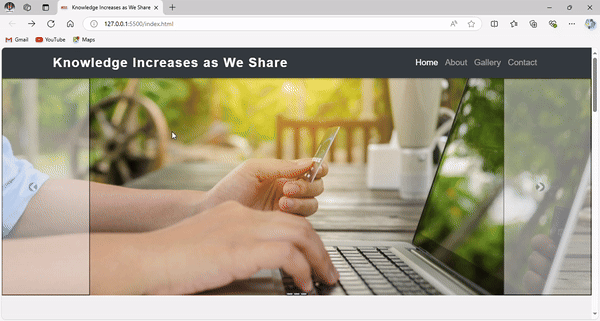

# 🌐 Website with Bootstrap

## 📖 Project Overview

**Website with Bootstrap** is a simple yet elegant responsive website designed to promote the idea that **sharing knowledge enriches everyone**. This project features a responsive navbar, a carousel slider for images, and dedicated sections to introduce the organization and its talented team.


### 💡 Knowledge Increases as We Share

**Description**  
"Knowledge Increases as We Share" is a responsive website aimed at fostering the sharing of knowledge and ideas. With its sleek navigation bar, dynamic image slider, and engaging sections, it showcases the organization and its members.


## 🌟 Features

- **Responsive Design**: Optimized for all screen sizes using Bootstrap.
- **Image Slider**: A beautiful carousel showcasing images relevant to the organization's mission.
- **Team Section**: Highlighting team member profiles and their contributions.

## 🛠️ Technologies Used

- **HTML**: The backbone structure of the web pages.
- **CSS**: Elegant styling to enhance visual appeal.
- **JavaScript**: Interactivity and functionality, especially for the image slider.
- **Bootstrap**: Front-end framework for responsive design.
- **Font Awesome**: Icons used throughout the site for better visual communication.

## 🚀 Getting Started

To clone this project, run the following command in your terminal:

```bash
git clone https://github.com/yasin-erkan/Website_with_Bootstrap.git
